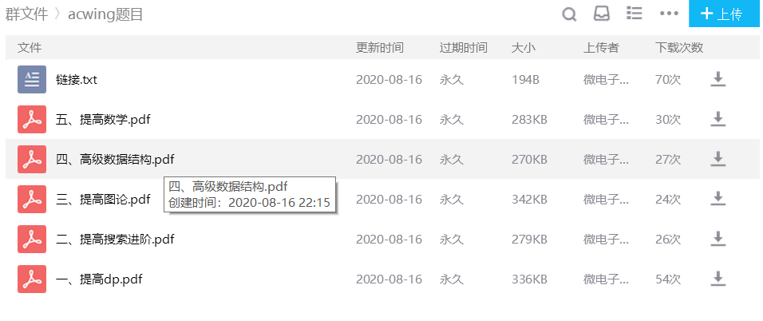

# 本web计划

## 主页课程资源和介绍、  吴老师课程、  domjudge、   vjudge题集、  icpc私云、  人物志、  返回qluoj、 个人后台    --后台登录页面

项目结构：

现为MongoDB数据库控制内容。

##页面前端计划展示

### 人物志  --/
1. 分类： 老师、 学生、 oj小组
2. 统计 观看数、点赞、评论、收藏（未实现）

### 课程资源    --/courses   分为吴老师课程+每日一题  
（可能会出现相应的显示内容过长）
  视频播放来源:
  浪在acm官方账号
  

  课程详情及相关比赛（类似于bilibili）
  观看数、点赞、评论、收藏

### domjudge
介绍、入口地址
  url: http://icpc.qlu.edu.cn/domjudge

### vjudge题集 -- /record
QQ群：浪在ACM  --群文件

### icpc私云  -- /qunhui
介绍、入口地址
  url: http://10.185.98.130:5000/   （写下转发，隐藏ip地址）  数据库控制内容

####比赛pdf的添加（已从qluoj实现相关功能）

### 返回qluoj
返回qluoj
  url: http://icpc.qlu.edu.cn/

--加入登录验证  jwt -token验证  （做了一半）  但未做好相应的校验   仅有登录后token的返回。
### 个人后台 （存在评论条数未查的展示）
个人信息展示
查看曾经的评论（课程、人物志）
展示收藏的内容（课程、人物志、相应vjudge测验）
##后台登录计划处理
1. 登录页面（后台）
2. 对上述页面的相应后台页面处理
